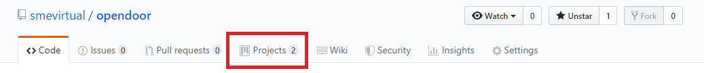

## Kanban Board for SME Virtual Network

The SME Virtual Network seeks to be the go-to resource for virtual engagement
and enrichment in the manufacturing and engineering community. We embrace
open-souece as a key part of that mission.

Additionally, an integral part of our open-source work also includes openness in the
way in which we are building the SME Virtual Network and what current projects and
tasks we are working on.

For those outside of the SME Virtual Network leadership that want to get involved (which
we highly encourage), the Kanban Board in this repository can provide you with insight
on where we are going, some ideas to consider, what we have on deck and who is leading what.

To get started, check out the 'Projects' tab on the upper part of your screen.

    

Join us on [Discord Chat](https://discord.gg/ufADa72) to ask questions, provide feedback,
and make any suggestions on future projects you would like to see.

### Licenses

The contents of this repository are licensed under [The MIT License](https://choosealicense.com/licenses/mit/).